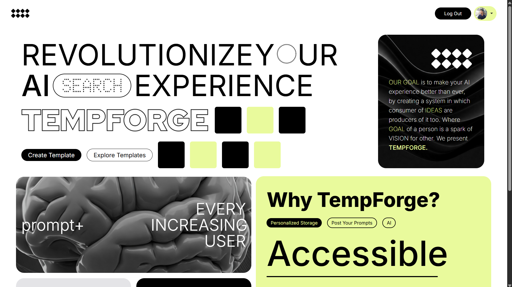

# Template Forge 
> Your intelligent prompt template creator that transforms single ideas into infinite possibilities through dynamic templating and AI-powered generation.



## What TempForge Does 🚀

TempForge is a comprehensive prompt template management platform that empowers users to create, customize,
and share dynamic AI prompt templates. 
Transform your workflow by building reusable templates that generate countless variations from a single well-crafted structure.

## Problem  🎯
Content creators, developers, and AI enthusiasts face significant challenges in prompt management:

- **Repetitive Prompt Creation** - Writing similar prompts repeatedly for different contexts wastes time and reduces productivity
- **Inconsistent Prompt Quality** - Manual prompt creation leads to varying quality and effectiveness across different use cases
- **Limited Template Reusability** - Most prompt tools lack sophisticated templating systems that allow for dynamic input substitution
- **Scattered Prompt Resources** - No centralized platform to discover, share, and collaborate on proven prompt templates

## My Solution 💡
TempForge bridges this gap by providing an intelligent templating ecosystem that combines powerful parsing capabilities with AI-generated suggestions. We're building a comprehensive platform that transforms how users create, manage, and share prompt templates.

## Features 🔍

### Dynamic Template Parser
- Custom parser engine that handles complex variable substitution
- Support for multiple input types and nested parameters
- Real-time template preview and validation

### AI-Powered Template Generation
- Gemini-integrated template creation for instant inspiration
- Automated optimization of template structure and variables

### Public Template Library
- Share your best templates with the global community
- Discover proven templates across different categories and use cases
- Community-driven template curation and rating system
- Easy template import and customization from the library

### Tech Stack ⚙️

**Frontend**: React.js + Material-UI
**Backend & Auth**: Firebase
**AI/ML**: Gemini 1.5 Flash
**Hosting**: Vercel
**Architecture**: Monorepo Structure

## Installation
1. Clone the repository:
   ```bash
   git clone https://github.com/iamtanishqsethi/temp-forge
   ```
2. Navigate to the project directory:
   ```bash
   cd temp-forge
   ```
3. Install dependencies:
   ```bash
   npm i 
   ```

4. Set up Firebase configuration:
- Create a ```.env``` file in the root directory
- Add your Firebase configuration keys

5. Run the application:
   ```bash
   npm run start
   ```
The app will be available at ```http://localhost:3000/```
